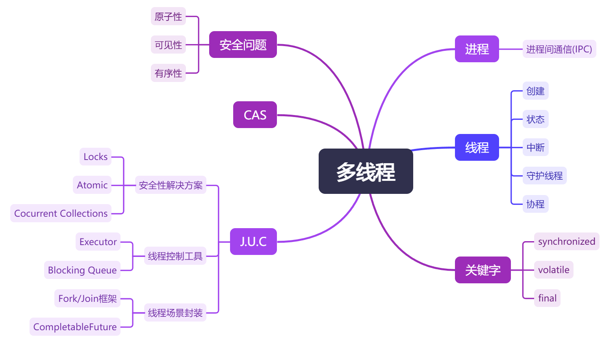

[TOC]


### 一、进程和线程

##### 进程和线程之间有什么区别？

> - 独立性：进程是独立的，一个进程的崩溃不会影响其他进程；而线程是进程内的执行单元，线程之间是相互依赖的，如果一个线程出错，可能会导致整个进程崩溃；
> - 资源占用：创建和管理进程需要更多的系统资源，而线程的创建和管理箱规轻量；
> - 通信：进程间通比较复杂，需要用到管道、消息队列等特殊机制；而线程之间的通信相对简单，因为它们共享相同的内存空间，可以直接通过读写进程中的共享变量进行。


##### 讲一讲进程间的通信方式(IPC)

> - 管道(Pipe)：这是最简单的IPC形式，数据从一个进程流向另一个进程，但是，管道通常只能在具有共同祖先的两个进程之间使用。这种方法主要用于数据的一对一通信；
> - 消息队列(Message Queue)：进程可以发送和接收消息，消息被存储在队列中，能够按照先进先出和优先级的顺序处理；
> - 信号(Signal)：同于通知某个进程发生了特定事件，可以传递简单的信息；
> - 套接字(Socket)：用于网络中进程间的通信，支持不同机器的进程之间的通信。


##### 讲一讲线程间的通信方式

> - 共享变量：由于线程共享内存，因此一个线程可以访问另一个线程的变量。但是，当两个线程需要访问同一个变量时，可能会产生冲突。因此，需要使用某种同步机制（如锁或信号量）来保护共享变量。
> - 锁机制：锁是一种保护资源不被多个线程同时访问的机制。当一个线程需要访问一个被锁保护的资源时，它必须首先获得锁。如果锁已经被另一个线程占用，那么这个线程就会等待，直到锁变为可用状态。
> - 条件变量：条件变量是一种让线程等待某个条件发生的机制。一个线程可以等待一个条件变量，而另一个线程则可以发出信号来表示某个条件已经发生，这会唤醒等待的线程。
> - 信号量和消息队列：与IPC中的类似；


##### 为什么要使用多线程进行程序设计？

> - 充分利用CPU性能，让多个线程同时在不同的核心上运行；
> - 提高响应性，可以让程序在处理复杂任务时仍然能处理用户的交互请求；
> - 简化复杂任务，可以把大任务分成小任务，通过不同的线程来处理，使设计更清晰。


##### Java中如何创建线程？

> - 继承`Thread`类，然后重写`Thread`类的`run()`方法，再创建子类的实例并调用其`start()`方法来启动线程：
>
>   ```java
>   class MyThread extends Thread {
>       public void run() {
>           // 线程中执行的代码...
>       }
>   }
>   
>   public class Main {
>       public static void main(String[] args) {
>           MyThread t = new MyThread();
>           t.start();	// 启动线程
>       }
>   }
>   ```
>
> - 实现`Runnable`接口，然后重写`Runnable`接口的`run()`方法，再创建子类的实例，并以此实例作为`Thread`的参数来创建`Thread`对象：
>
>   ```java
>   class MyRunnable implements Runnable {
>       public void run() {
>           // 要执行的代码...
>       }
>   }
>   
>   public class Main {
>       public static void main(String[] args) {
>           MyRunnable r = new MyRunnable();
>           MyThread t = new MyThread(r);  // 创建真正的线程对象
>           t.start();	// 启动线程
>       }
>   }
>   ```
>
> - 实现`Callable`接口，和`Runnable`类似，但是与`Runnable`相比，`Callable`可以有返回值，返回值通过`FutureTask`进行封装：
>
>   ```java
>   class MyCallable implements Callable<Integer> {
>       public Integer run() {
>           // 要执行的代码...
>           // 返回值为Integer类型
>       }
>   }
>   
>   public class Main {
>       public static void main(String[] args) {
>           MyCallable c = new MyCallable();
>           FutureTask<Integer> task = new FutureTask<>(c);  // 封装的结果对象
>           MyThread t = new MyThread(task);  // 创建真正的线程对象
>           t.start();	// 启动线程
>           Integer result = task.get();  // 获取线程返回值
>       }  
>   }
>   ```
>
> - 使用`ExecutorService(线程池)`，从Java 1.5开始，可以通过`Executor`框架在Java中创建线程池：
>
>   ```java
>   public class Main {
>       public static void main(String[] args) {
>           ExecutorService executor = Executors.newFixedThreadPool(5);
>           for (int i = 0; i < 10; i++) {
>               executor.execute(new Runnable() {
>                   public void run() {
>                       // 要执行的代码...
>                   }
>               });
>           }
>           executor.shutdown();
>       }
>   }
>   ```


##### 守护线程是什么？它和普通线程有什么不同？

> 守护线程是一种特殊的线程，它的主要作用是为其他线程提供服务，比如执行后台任务。与普通线程不同，守护线程的生命周期与程序中的其他非守护线程相关联。当所有非守护线程都结束时，整个程序会自动关闭，包括守护线程。
>
> 可以通过`Thread`对象的`setDaemon(true)`方法来设置守护线程，例如下面这个守护线程`DaemonThreadExample`：
>
> ```java
> public class DaemonThreadExample extends Thread {
>     public void run() {
>         // 守护线程需要执行的代码...
>     }
> 
>     public static void main(String[] args) {
>         Thread t = new DaemonThreadExample();
>         t.setDaemon(true);	// 设置为守护线程
>         t.start();	// 启动守护线程
>         // 其他代码...
>         // 所有非守护线程结束后守护线程会自动关闭
>     }
> }
> ```


##### 线程有哪些状态？它们之间之如何转变的？

> - New(新建)：创建后还未启动；
> - Runnable(就绪)：程序已经启动好并准备运行，但可能在等待系统调度；
> - Running(运行)：线程正在运行；
> - Blocked(阻塞)：线程因等待获取锁而被阻塞；
> - Waiting(等待)：线程正在等待另一个线程的特定动作，如`wait()`、`join()`等；
> - Timed Waiting(超时等待)：线程在等待某个条件的同时设置了超时时间；
> - Terminated(终止)：线程已完成或因异常终止。
>
> 线程状态间的转换关系如下：
>
> ```mermaid
> graph LR 
>     A([New]) -->|"start()"| B([Runnable])  
>     subgraph run
>     	B <-->|调度| C([Running]) 
>     end
>     run -->|完成| D([Terminated])  
>     run -->|"wait()"| E([Waiting])  
>     run -->|"sleep()"| F([Timed Waiting])  
>     E -->|"notify()"| run  
>     E -->|"interrupt()"| run  
>     F -->|时间到| run  
>     F -->|"interrupt()"| run  
>     run -->|锁被占用| G([Blocked])  
>     G -->|获取锁| run  
>     G -->|"interrupt()"| run
>     E -->|Exception| D
>     F -->|Exception| D
>     G -->|Exception| D
> ```


##### 请解释一下wait()、notify()、notifyAll()方法的用途和原理

> - wait：当一个线程调用对象的wait方法时，它会释放该对象的锁并进入等待状态，直到其他线程调用同一个对象的notify或notifyAll方法。这个线程会被挂起，直到它被唤醒。
> - notify：当一个线程调用对象的notify方法时，它会唤醒在该对象上等待的一个线程。这个线程会从wait状态恢复并重新竞争锁，但不会立即获得锁，必须等待当前持有锁的线程释放它。
> - notifyAll：类似于notify，但notifyAll会唤醒所有在该对象上等待的线程。所有被唤醒的线程会争夺锁，有可能导致上下文切换。


##### 为什么 wait()、notify()、notifyAll()方法定义在 Object 类中而不是 Thread 类中?

> 因为在Java中，每个对象都有一个内置的锁（也称为监视器或监视器锁）。当一个线程访问一个同步方法或同步块时，它必须先获得该对象的锁，而 `wait`、`notify` 和 `notifyAll` 方法是用来控制对象的线程行为的，这些方法与对象的锁密切相关，因此这些方法定义在 `Object` 类中，使得任何对象都可以使用这些方法来进行锁的加减。相反，`Thread` 类主要关注线程的操作，而不是与线程自身相关。因此，将这些方法放在 `Object` 类中更合适。


##### Java中如何设置线程的优先级？

> 线程的优先级是一个整数，其范围从`Thread.MIN_PRIORITY`（值为1）到`Thread.MAX_PRIORITY`（值为10）。默认的优先级是`Thread.NORM_PRIORITY`（值为5）。可以通过`Thread`类的`setPriority(int newPriority)`方法来设置线程的优先级，通过`getPriority()`方法来获取线程的优先级。


##### Java中如何确保多个线程按照特定顺序执行？

> - 使用`Thread.join()`方法，在一个线程中调用其他线程的`join`方法，可以确保前一个线程执行完后，下一个线程才能开始；
> - 使用`wait()`和`notify()`方法，在一个对象上调用`wait`方法，当前线程会释放该对象的锁并进入等待状态，直到其他线程调用同一对象的`notify`或`notifyAll`方法来唤醒它；
> - 可以用一个对象的锁来控制线程的执行顺序，通过条件变量来让线程等待和通知；
> - 可以用`Semaphore`控制线程的执行顺序，通过设置信号量来限制线程的执行。


##### 为什么启动线程要用start()方法而不是run()方法？

> 因为 start 方法会创建一个新的线程，并在这个新线程中运行 run 方法的代码。调用 run 方法直接在当前线程中执行，并不会创建新的线程，这样就无法实现并发执行。


##### sleep()和wait()有什么区别？

> - 所属类：`sleep()`方法是`Thread`类的静态方法，而`wait()`方法是 `Object`类的实例方法。
> - 作用：`sleep()`方法让当前线程暂停指定的时间，而 `wait()`方法让当前线程等待，直到其他线程调用同一个对象的 `notify()`或 `notifyAll()`方法。
> - 释放锁：`sleep()`方法不释放锁，线程在睡眠期间仍然持有对象的锁；而 `wait()`方法会释放锁，直到被唤醒后才能继续执行。
> - 使用场景：`sleep()`方法通常用于控制线程的执行时间，`wait()`方法则用于线程间的协作和通信。


##### Thread.yield()方法的作用是什么？

> `Thread.yield()` 方法的作用是让当前正在执行的线程暂停，让其他线程有机会执行。它告诉线程调度器，当前线程愿意放弃CPU的使用权，从而提高其他线程的执行机会，但并不保证其他线程一定会执行。


##### 如何理解Java中的线程中断机制？

> Java 中的线程中断机制主要用于控制线程的执行。每个线程都有一个中断标志，如果这个标志被设置为true，表示线程被请求中断。当线程检测到被中断时，通常会做一些清理工作，然后结束自己。中断是一种合作方式，线程之间需要相互尊重中断请求，来安全地结束执行。
>
> 线程可以通过调用 `Thread.interrupt()` 方法来中断另一个线程。当一个线程被中断时，它不会立刻停止，而是会在下一次检查中断状态时（比如通过 `Thread.sleep()`、`Object.wait()`，或者在自己的代码中显式检查）采取相应的行动。检查中断状态有两种办法：
>
> - 使用 `Thread.interrupted()` 方法，它会检查并清除当前线程的中断状态；
> - 调用 `Thread.currentThread().isInterrupted()`，这不会改变中断状态。
>
> 例如：
>
> ```java
> @Override
> public void run() {
>     while (!Thread.currentThread().isInterrupted()) {
>         // 执行任务
>     }
>     System.out.println("线程已中断");
> }
> ```


### 二、安全问题

##### 什么是原子性？

>这是并发并发编程中的一个关键概念，它的意思是一个操作要么完全执行，要么完全不执行，不会被其他线程中断。如`i = 1`就是原子性操作，只有赋值一个操作，而`i++`不是原子性操作，因为它有读取、加一、写回三个操作。在Java中，对基本数据类型（除了long和double，因为它们是64位的，在32位系统上操作时可能会导致并发情况下的状态不一致）的读取和写入操作都是原子的，但对于`i++`这样的复合操作就需要使用`synchronized`关键字或者`java.util.concurrent(J.U.C)`包中的类来保证原子性。


##### 什么是可见性？

>在并发编程中，可见性指的是一个线程对共享变量的修改能够被其他线程及时看到的能力。在Java中提供了`volatile`关键字来保证可见性，当一个共享变量被`volatile`修饰时，它会保证修改的值会立即被更新到主存，当有其他线程需要读取时，它会去内存中读取新值。Java中的`final`关键字也能保证有序性，因为当一个对象被创建时，如果它的`final`字段在构造函数中被初始化，那么当构造函数结束时，任何获取到该对象引用的线程都将看到`final`字段已经被初始化完成的值，即使没有使用锁或者其他同步机制。另外，通过`synchronized`和`Lock`也能保证可见性，它们是通过保证同一时刻只有一个线程获取锁然后执行同步代码，并且在释放锁之前会将对变量的修改刷新到主存中，因此保证了可见性。


##### 什么是有序性？

>在并发编程中，有序性指的是程序执行的顺序必须遵循特定的逻辑顺序，即希望代码的执行结果是可预测的。在Java中可以通过`volatile`关键字来保证一定的“有序性”，也可以通过`synchronized`和`Lock`来保证有序性，显然保证每一个线程都是同步代码就相当于是顺序执行，自然就有了有序性。


##### Java多线程中并发问题都有什么？怎么解决？

> - 竞争条件：当两个或多个线程同时访问和修改共享数据时，可能会导致数据不一致。例如，两个线程同时对一个计数器进行递增操作，最终的结果可能不是预期的值。可以通过`synchronized`关键字来确保同一时间只有一个线程可以访问共享资源，以及`Lock`提供的更灵活的锁机制；
> - 死锁：当两个或多个线程互相等待对方释放资源时，会导致程序无法继续执行。可以通过避免嵌套锁、使用定时锁和资源排序等方法来解决；
> - 饥饿：某些线程可能永远无法获得所需的资源，导致无法执行。这通常发生在高优先级线程持续占用资源时。可以通过使用公平锁或者调整线程优先级来解决；
> - 资源竞争：多个线程同时竞争同一资源，可能导致性能下降。可以尽量缩小锁的范围，只在必要的代码块中使用锁，或者使用无锁数据结构，如`ConcurrentHashMap`等并发集合类；
> - 可见性问题：一个线程对共享变量的修改可能对其他线程不可见，导致读取到过时的数据。可以使用`volatile`关键字，或者使用`synchronized`和`Lock`的同步机制。


### 三、关键字

##### synchronized本质上是通过什么来保证线程安全的？

> - **加锁和释放锁**：当一个线程使用synchronized块时，它会获得一个对象的锁（在字节码中为`monitorenter`指令），其他线程不能同时访问这个synchronized块，直到第一个线程释放锁（在字节码中为`monitorexit`指令）；
> - **加锁次数计数器**：当一个线程首次获得锁时，计数器的值将设置为1，每次该线程再次请求同一把锁时，计数器的值将增加1。当线程释放锁时，计数器的值会减少1，直到计数器为0，此时锁才会被完全释放。
>
> - **happens-before规则**：
>   - 一个线程对一个对象的锁操作（例如，进入一个 synchronized 方法或块）会发生在同一个线程后续对该对象的解锁操作之前；
>   - 另一个线程在获取同一个对象的锁后，可以看到第一个线程在解锁之前对共享变量的所有修改；
>   - 任何线程在退出一个 synchronized 块时，都会“发生在”其他线程进入同一个 synchronized 块之前。


##### synchronized使得同时只有一个线程可以执行，性能较差，有什么优化的方法？

> 在JVM中`synchronized`的加锁和释放锁依赖于底层操作系统Mutex Lock，但是使用Mutex Lock需要将当前进程挂起并从用户态切换到内核态来执行，这种切换的代价十分昂贵。因此在jdk1.6中对锁的实现引入了大量的优化，具体如下：
>
> - 锁粗化(Lock Coarsening)：把多个对同一对象的锁操作合并成一个，这样可以减少加锁和解锁的次数，从而提高效率。例如，如果在循环中多次对同一个对象加锁，可以将这些操作合并为一个。
> - 锁消除(Lock Elimination)：当程序分析发现某个锁不可能被多个线程共享时，可以消除这个锁，避免不必要的加锁操作。这通常发生在局部变量上，因为它们的作用范围有限，其他线程是不可能访问的。
> - 轻量级锁(Lightweight Locking)：在获取锁时，如果发现当前锁没有被其他线程占用，则可以使用一种更轻量级的方式（比如自旋锁）来获取锁，而不是进行复杂的操作。
> - 偏向锁(Biased Locking)：如果一个线程多次访问一个对象，它可以将这个对象的锁“偏向”于这个线程，从而在后续的加锁和解锁操作中省掉一些开销。
> - 适应性自旋(Adaptive Spinning)：当一个线程尝试获取锁但发现被其他线程占用时，它可以选择在短时间内“自旋”（循环等待），而不是立即挂起自己。这种方法可以在确保锁较快释放的情况下，提高获取锁的效率。


##### synchronized在使用时有什么需要注意的？

> - 尽量缩小`synchronized`块的范围，只锁必要的代码，避免影响性能；
> - 确保多个线程获取锁的顺序一致，避免相互等待导致的死锁；
> - 不要在同步块里调用外部方法，外部方法可能会获取锁从而导致死锁；
> - 根据需要选择加锁方式，尽量优先选择J.U.C中提供的各种类，其次再选择`synchronized`关键字，因为代码量少可以避免出错。


##### synchronized修饰的方法在抛出异常时会释放锁吗？

> 会释放锁


##### 多个线程等待同一个synchronized锁的时候，JVM如何选择下一个获取锁的线程?

> JVM会根据不同的策略来选择下一个获取锁的线程，这通常是采用非公平的方式，如常用的“自适应自旋”策略，系统会记录哪个线程最近获得了锁，并优先让它获得锁，不过同时也会受到其他因素的影响，如优先级等。这种方法能够帮助减少线程竞争和上下文切换的开销。


##### volatile关键字的有什么用？

> - 防止重排序：编译器和处理器可能会对语句和指令的执行顺序进行改变以提高效率，但是这可能会导致可见性问题，如对象的构造分为三个步骤：1.分配内存空间 2.初始化对象 3.将内存地址复制给对应的引用，但是处理器可能会将指令2和3的顺序交换，这就可能就将一个没有初始化的对象暴露出来，但是使用`volatile`关键字修饰以后，就可以避免这种重排序；
> - 实现可见性：当一个共享变量被`volatile`修饰时，它会保证修改的值会立即被更新到主存，当有其他线程需要读取时，它会去内存中读取新值。


##### 32位机器上共享的long和double变量为什么要用volatile？

> 因为这两种类型的变量在内存中的长度超过了32位。它们的读写操作可能会被划分为两个32位的部分。如果没有`volatile`，线程可能会看到变量的部分更新，导致数据不一致。不过目前各种平台下的商用虚拟机都选择把 64 位数据的读写操作作为原子操作来对待，因此我们在编写代码时一般不把long 和 double 变量专门声明为 volatile多数情况下也是不会错的。


##### final修饰的字段都是编译期常量吗？

> 不是所有使用final修饰的字段都是编译期常量。只有被final修饰并且是静态的字段（也就是static final）的字段才是编译期常量。普通的final字段在运行时也可以被赋值，但不能再修改。


##### final可以被重载吗？

> 父类的`final`方法是不能被子类重写的，但是是可以被重载的。


##### final的重排序规则和原理是什么？

> - 写final域：在构造函数内对一个final域的写入（初始化），和之后把这个被构造的对象的地址赋值给对应的引用，这两个操作之间不能重排序；
>   - 原理：会要求编译器在final域写之后，构造函数返回前插入一个StoreStore屏障；
> - 读final域：初次读取一个包含final域的对象的引用，和之后读取这个final域，这两个操作之间不能重排序；
>   - 原理：会要求编译器在final域读之前插入一个LoadLoad屏障。


### 四、CAS

##### 什么是CAS？它在并发编程中有什么用？

> CAS是Compare And Swap（比较并交换）的缩写，它是一种用于处理并发编程的原子性操作。它包含三个操作数：`内存位置(V)`、`预期原值(A)`、`新值(B)`，当且仅当内存位置的值域预期原值相同时，才会将该位置的值更新为新值，否则什么都不做。最后总是返回该位置的旧值。
>
> 在并发编程中，CAS 操作常用于实现无锁数据结构和同步机制，帮助避免使用传统的锁，从而提高程序的性能和响应速度。


##### CAS有哪些问题？如何避免？

> - CAS 能检测到内存值是否发生了变化，但无法检测到变化的过程，如内存原值为A，后来被改为B，又被改回A，这种情况CAS会认为内存值没有变化，从而导致潜在的问题；
>   - 可以使用版本号或者时间戳来标记内存值的变化；
> - 当CAS操作失败时，通常会不断重试，即自旋，在高并发场景下，如果某个线程长时间自旋，就会导致CPU资源的浪费；
>   - 使用自适应的自旋策略，限制自旋次数或者根据线程优先级调整自旋时间等；
> - 只能保证单个共享变量的原子操作，如果需要对多个共享变量进行原子操作，就无法直接使用CAS；
>   - 可以使用锁机制或者将多个共享不了封装成一个对象，然后使用CAS操作对象的引用。


##### CAS操作在Java中是怎么实现的？

> CAS在Java中的实现主要依赖于`java.util.concurrent.atomic`包下的一些原子类，如`AtomicInteger`、`AtomicLong`、`AtomicReference`等。
>
> 而这些原子类的内部实现，主要依赖于JDK的`sun.misc.Unsafe`类中的一些方法，如`compareAndSwapInt`、`compareAndSwapLong`等，提供了硬件级别的CAS支持。
>
> 而在更底层，`Unsafe`类的这些方法通常会被JVM翻译成处理器支持的原子操作指令。


### 五、J.U.C

#### 5.1 安全性解决方案


#### 5.2 线程控制工具


#### 5.3 线程场景封装
